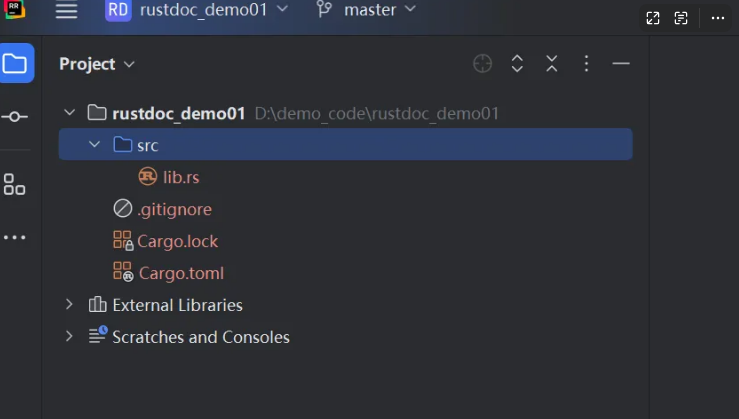
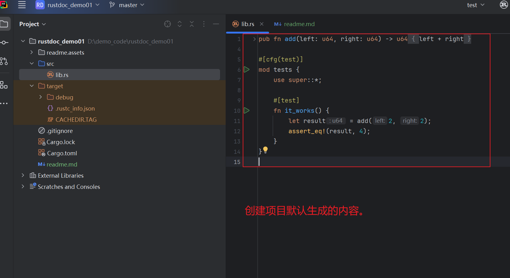

# 什么是rustdoc？


## 1)创建一个rust的lib项目

使用如下的命令创建项目：

```shell
$ cargo new docs --lib
$ cd docs
```

`docs:`表示项目的名字。我当前仓库的项目名字叫：rustdoc_demo01。所以使用如下的命令来。

```shell
cargo new rustdoc_demo01 --lib
```

创建的结果：




初始化时的项目目录：

```shell
D:.
│  .gitignore
│  Cargo.lock
│  Cargo.toml
│
├─src
│      lib.rs
│
└─target
    │  .rustc_info.json
    │  CACHEDIR.TAG
    │
    └─debug
        │  .cargo-lock
        │
        ├─.fingerprint
        │  ├─rustdoc_demo01-746d9f80ad8ad1ab
        │  │      invoked.timestamp
        │  │      lib-rustdoc_demo01
        │  │      lib-rustdoc_demo01.json
        │  │
        │  └─rustdoc_demo01-eb58dd0c8dd7f4dc
        │          invoked.timestamp
        │          test-lib-rustdoc_demo01
        │          test-lib-rustdoc_demo01.json
        │
        ├─build
        ├─deps
        ├─examples
        └─incremental
```


## 2)编写一个函数文档





使用如下的代码去替换上面默认生成的代码。

```rust
/// foo is a function
fn foo() {}
```


