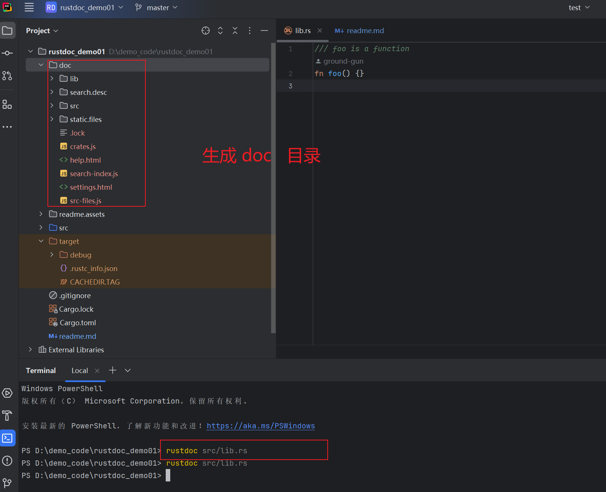
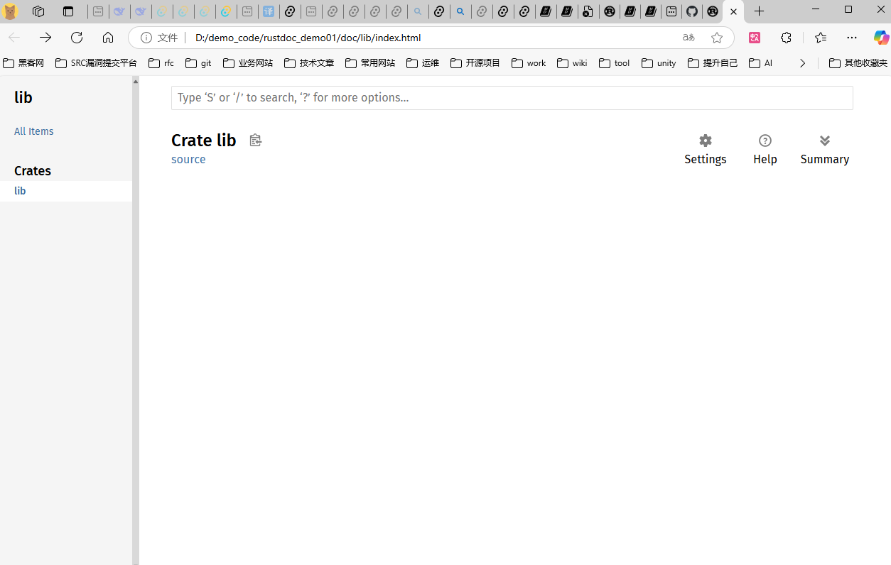
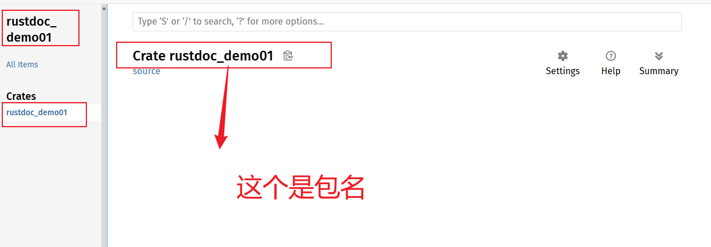
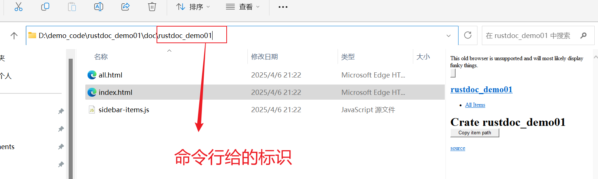

# 什么是rustdoc？


## 1)创建一个rust的lib项目

使用如下的命令创建项目：

```shell
$ cargo new docs --lib
$ cd docs
```

`docs:`表示项目的名字。我当前仓库的项目名字叫：rustdoc_demo01。所以使用如下的命令来。

```shell
cargo new rustdoc_demo01 --lib
```

创建的结果：


初始化时的项目目录：

```shell
D:.
│  .gitignore
│  Cargo.lock
│  Cargo.toml
│
├─src
│      lib.rs
│
└─target
    │  .rustc_info.json
    │  CACHEDIR.TAG
    │
    └─debug
        │  .cargo-lock
        │
        ├─.fingerprint
        │  ├─rustdoc_demo01-746d9f80ad8ad1ab
        │  │      invoked.timestamp
        │  │      lib-rustdoc_demo01
        │  │      lib-rustdoc_demo01.json
        │  │
        │  └─rustdoc_demo01-eb58dd0c8dd7f4dc
        │          invoked.timestamp
        │          test-lib-rustdoc_demo01
        │          test-lib-rustdoc_demo01.json
        │
        ├─build
        ├─deps
        ├─examples
        └─incremental
```


## 2)编写一个函数文档


使用如下的代码去替换上面默认生成的代码。

```rust
/// foo is a function
fn foo() {}
```


```shell
rustdoc src/lib.rs
```

执行`rustdoc src/lib.rs`命令将会生成一个新的目录`doc`。注意：是在项目的根目录下生成的。




在windows电脑上使用`tree /f`命令查看当前的目录结构如下：

```shell
D:.
│  .gitignore
│  Cargo.lock
│  Cargo.toml
│  readme.md
│
├─.idea
│      .gitignore
│      modules.xml
│      rustdoc_demo01.iml
│      vcs.xml
│      workspace.xml
│
├─doc
│  │  .lock
│  │  crates.js
│  │  help.html
│  │  search-index.js
│  │  settings.html
│  │  src-files.js
│  │
│  ├─lib
│  │      all.html
│  │      index.html
│  │      sidebar-items.js
│  │
│  ├─search.desc
│  │  └─lib
│  │          lib-desc-0-.js
│  │
│  ├─src
│  │  └─lib
│  │          lib.rs.html
│  │
│  └─static.files
│          COPYRIGHT-23e9bde6c69aea69.txt
│          favicon-2c020d218678b618.svg
│          favicon-32x32-422f7d1d52889060.png
│          FiraSans-LICENSE-db4b642586e02d97.txt
│          FiraSans-Medium-8f9a781e4970d388.woff2
│          FiraSans-Regular-018c141bf0843ffd.woff2
│          LICENSE-APACHE-b91fa81cba47b86a.txt
│          LICENSE-MIT-65090b722b3f6c56.txt
│          main-f070b9041d14864c.js
│          NanumBarunGothic-0f09457c7a19b7c6.ttf.woff2
│          NanumBarunGothic-LICENSE-18c5adf4b52b4041.txt
│          normalize-76eba96aa4d2e634.css
│          noscript-0111fcff984fae8f.css
│          rust-logo-151179464ae7ed46.svg
│          rustdoc-b0742ba02757f159.css
│          scrape-examples-46fc985aa763a438.js
│          search-f0d225181b97f9a4.js
│          settings-805db61a62df4bd2.js
│          SourceCodePro-It-1cc31594bf4f1f79.ttf.woff2
│          SourceCodePro-LICENSE-d180d465a756484a.txt
│          SourceCodePro-Regular-562dcc5011b6de7d.ttf.woff2
│          SourceCodePro-Semibold-d899c5a5c4aeb14a.ttf.woff2
│          SourceSerif4-Bold-a2c9cd1067f8b328.ttf.woff2
│          SourceSerif4-It-acdfaf1a8af734b1.ttf.woff2
│          SourceSerif4-LICENSE-3bb119e13b1258b7.md
│          SourceSerif4-Regular-46f98efaafac5295.ttf.woff2
│          src-script-e66d777a5a92e9b2.js
│          storage-1d39b6787ed640ff.js
│
├─readme.assets
│      image-20250406210109722.png
│      image-20250406210306399.png
│      image-20250406211037506.png
│      image-20250406211220146.png
│
├─src
│      lib.rs
│
└─target
    │  .rustc_info.json
    │  CACHEDIR.TAG
    │
    └─debug
        │  .cargo-lock
        │
        ├─.fingerprint
        │  ├─rustdoc_demo01-746d9f80ad8ad1ab
        │  │      invoked.timestamp
        │  │      lib-rustdoc_demo01
        │  │      lib-rustdoc_demo01.json
        │  │
        │  └─rustdoc_demo01-eb58dd0c8dd7f4dc
        │          invoked.timestamp
        │          test-lib-rustdoc_demo01
        │          test-lib-rustdoc_demo01.json
        │
        ├─build
        ├─deps
        ├─examples
        └─incremental

```


主页位于 `doc/lib/index.html` 。如果你在网络浏览器中打开它，你会看到一个带有搜索栏的页面，顶部有“Crate lib”，没有任何内容。





## 3)配置rustdoc

- 问题1：为什么它会认为我们的包名为“lib”？
- 问题2：为什么它没有任何内容？


第一个问题是由于 `rustdoc` 试图提供帮助；与 `rustc` 一样，它**假定**我们的**包的名称**是<font color = 'red'>包根文件的名称</font>。为了解决这个问题，我们可以传入一个命令行标志：

```shell
rustdoc src/lib.rs --crate-name docs
```

我们这因为仓库的名字是rustdoc_demo01。所以上面命令要修改如下：

```shell
rustdoc src/lib.rs --crate-name rustdoc_demo01
```




现在，将生成 `doc/命令行标识（用户定义）/index.html` ，并且页面显示“命令行标识（用户定义）”。



